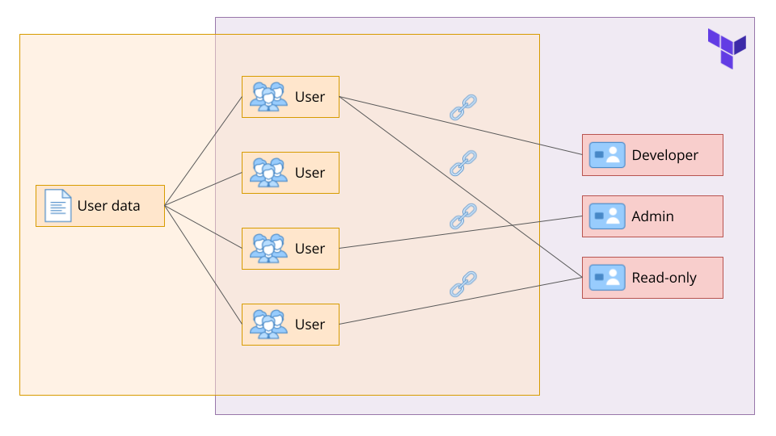

# Managing IAM Users and Roles with Terraform

This project is centered around managing AWS Identity and Access Management (IAM) users and roles using Terraform and YAML. The primary objective is to automate the process of creating users, assigning roles, and ensuring secure role assignment. User information, including usernames and roles, will be stored in a YAML file, while role information will be managed in Terraform. An important aspect of this project is to ensure that roles can only be assumed by the users assigned to them, adding an extra layer of security.

## Project Overview

## Desired Outcome

1. Store user information (username and their respective roles) in a YAML file.
2. Store role information (role name and their respective policies) in Terraform.
    1. **Hint:** You can use AWS-Managed policies to make your life easier, but if you wish an extra layer of learning and challenge, by all means go ahead and create your own policies!
3. Based on the provided YAML file, create users in the AWS account.
4. Also make sure to create login profiles for the users, so that they can login into the AWS console.
    1. **Hint:** Setting up the necessary elements to send passwords securely via email can be quite cumbersone. Although you should **never do that in real-life, production projects**, for our purposes here free to output this information from Terraform.
5. Based on the role information stored in Terraform, create the respective roles and attach the correct policies to these roles.
6. Based on the YAML file, link created users to the respective roles they can assume.
7. Ensure that roles can only be assumed by the users that are assigned to those roles.
8. Test everything in the AWS console, it's quite fun!
9. Make sure to delete all the resources at the end of the project!
